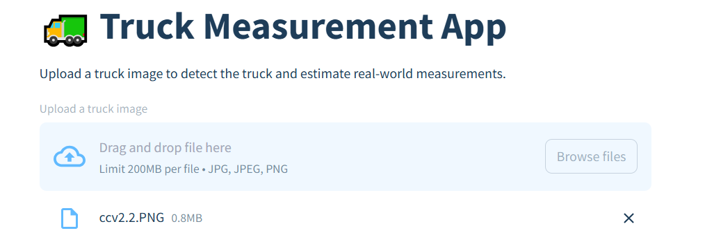
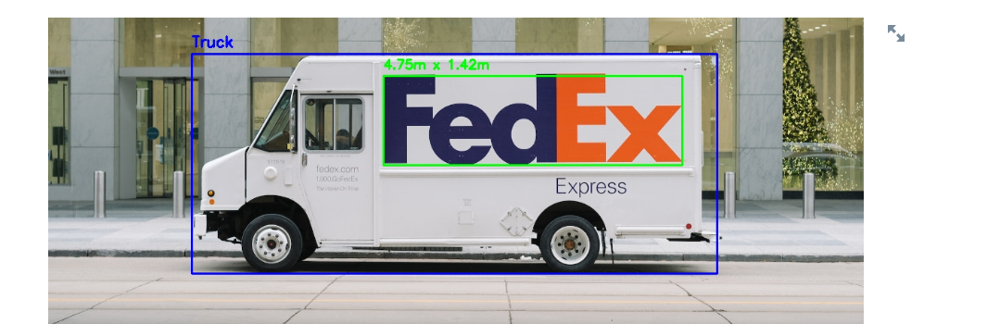

# 🚛 Truck Measurement System

A computer vision system that automatically detects trucks in images, classifies their type, and estimates real-world dimensions such as width and height. Built with **YOLOv8**, **OpenCV**, and **Streamlit**, this project demonstrates how deep learning and traditional image processing can be combined to deliver practical measurement tools.

## ✨ Features

- **🔍 Truck Detection** – Uses YOLOv8 to detect trucks in uploaded images
- **📋 Truck Classification** – Categorizes trucks (Semi Trailer, Box Truck, Cube Van, Sprinter Van, Cargo Van)
- **📏 Real-world Measurement** – Estimates width and height in meters based on known truck height references
- **🖥️ Interactive Web App** – Simple Streamlit interface to upload images and view results instantly
- **💻 CLI Support** – Run from the command line to process and save annotated images

## 📂 Project Structure

```
truck-measurement-system/
│
├── truck_measurement/           # Core package
│   ├── __init__.py
│   ├── main.py                 # CLI entry point
│   ├── detector.py             # YOLO detection
│   ├── classifier.py           # Classification logic
│   ├── measurement.py          # Measurement calculations
│   ├── visualizer.py           # Drawing overlays
│   └── utils.py                # Logging + validation
│
├── tests/                      # Unit tests
├── examples/                   # Example scripts/images
├── app.py                      # Streamlit app
├── run_web_app.py             # Launcher
├── requirements.txt           # Dependencies
├── setup.py                   # Installer
└── README.md                  # Documentation
```

## 🚀 Getting Started

### Prerequisites

- Python 3.8 or higher
- pip package manager

### Installation

1. **Clone the repository**

   ```bash
   git clone https://github.com/yourusername/truck-measurement-system.git
   cd truck-measurement-system
   ```

2. **Install dependencies**

   ```bash
   pip install -r requirements.txt
   ```

3. **Install package locally (optional)**
   ```bash
   pip install -e .
   ```

### Usage

#### Web Application

Launch the Streamlit web interface:

```bash
streamlit run app.py
```

or

```bash
python run_web_app.py
```

#### Command Line Interface

Process a single image:

```bash
python -m truck_measurement.main path/to/image.jpg -o output.jpg --scale 0.6
```

**CLI Options:**

- `-o, --output`: Output file path for annotated image
- `--scale`: Scale factor for image resizing (default: 0.6)
- `--confidence`: Detection confidence threshold (default: 0.5)

## 🖼️ Screenshots

### Web Interface



### Detection Results



## ⚙️ Configuration

### YOLO Model Options

- **Default**: `yolov8n.pt` (fast, lightweight)
- **Better accuracy**: Switch to `yolov8m.pt` or `yolov8l.pt`
- **Custom models**: Train your own model for specific truck types

### Measurement Calibration

The system uses reference truck heights for scale calculation:

- Semi Trailer: ~4.1m height
- Box Truck: ~3.5m height
- Cube Van: ~2.8m height
- Sprinter Van: ~2.5m height
- Cargo Van: ~2.2m height

### Customization

- Modify `detector.py` to include additional vehicle classes
- Adjust confidence thresholds in configuration
- Update measurement references in `measurement.py`

## 🛠️ Development

### Running Tests

```bash
python -m pytest tests/
```

### Code Structure

- `detector.py` - YOLO model loading and inference
- `classifier.py` - Truck type classification logic
- `measurement.py` - Dimension calculation algorithms
- `visualizer.py` - Image annotation and overlay generation
- `utils.py` - Utility functions and logging

## 📊 Technical Details

### Dependencies

- **ultralytics** - YOLOv8 implementation
- **opencv-python** - Image processing
- **streamlit** - Web interface
- **pillow** - Image handling
- **numpy** - Numerical operations

### Performance

- Detection speed: ~50-100ms per image (CPU)
- Memory usage: ~500MB with yolov8n model
- Supported formats: JPG, PNG, BMP, TIFF

## 🔮 Future Improvements

- [ ] Fine-tune YOLO model specifically for delivery vans and box trucks
- [ ] Add support for video stream detection
- [ ] Implement more robust measurement calibration using reference objects
- [ ] Export detection results to CSV/JSON formats
- [ ] Add batch processing capabilities
- [ ] Integrate with camera feeds for real-time detection
- [ ] Mobile app deployment

## 📝 License

This project is licensed under the MIT License - see the [LICENSE](LICENSE) file for details.

## 🤝 Contributing

1. Fork the project
2. Create your feature branch (`git checkout -b feature/AmazingFeature`)
3. Commit your changes (`git commit -m 'Add some AmazingFeature'`)
4. Push to the branch (`git push origin feature/AmazingFeature`)
5. Open a Pull Request

## 👨‍💻 Author

**Rroopesh Hari**  
Data Science @ Oklahoma State University

- GitHub: [@yourusername](https://github.com/yourusername)
- LinkedIn: [Your LinkedIn Profile](https://linkedin.com/in/yourprofile)
- Email: your.email@example.com

## 🙏 Acknowledgments

- [Ultralytics](https://ultralytics.com/) for the YOLOv8 implementation
- [Streamlit](https://streamlit.io/) for the easy-to-use web framework
- [OpenCV](https://opencv.org/) for computer vision tools

## 📈 Project Status

This project is actively maintained and under development. Feel free to report issues, suggest features, or contribute to the codebase!

---

**⭐ Star this repository if you find it helpful!**
