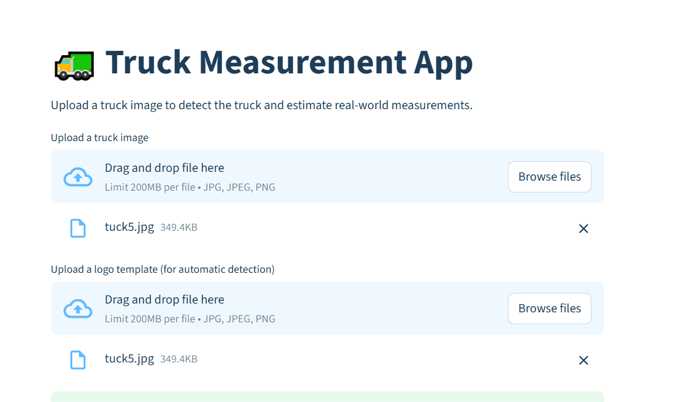
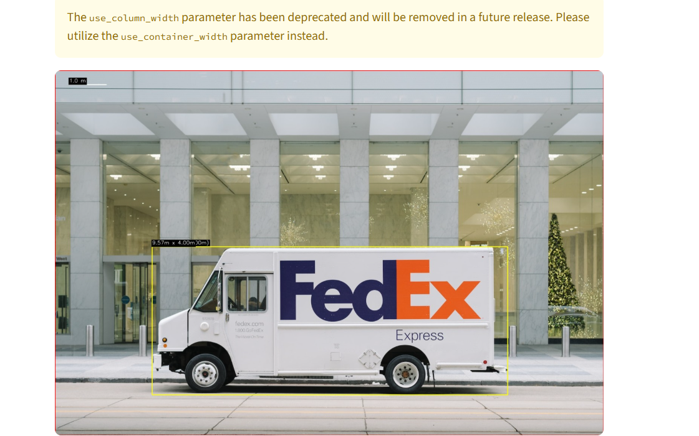
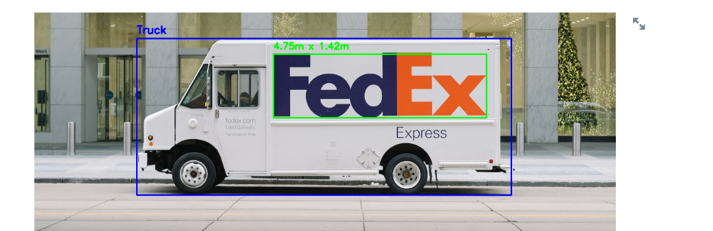

# Truck Measurement System – Detailed Project Report

## Project Overview
This project is a computer vision system designed to automatically detect trucks in images, classify their type, estimate their real-world dimensions (width and height), and measure logos on trucks. It combines deep learning (YOLOv8), image processing (OpenCV), and a user-friendly web interface (Streamlit).

## Main Features
- **Truck Detection:** Finds trucks in uploaded images using YOLOv8.
- **Truck Classification:** Identifies the type of truck (Semi Trailer, Box Truck, Cube Van, Sprinter Van, Cargo Van).
- **Real-world Measurement:** Estimates truck width and height in meters using known reference heights for each truck type.
- **Automatic Logo Measurement:** Upload a logo template image; the app finds and measures the logo on the truck using OpenCV template matching.
- **Interactive Web App:** Simple Streamlit interface for uploading images and viewing results instantly.
- **Command Line Support:** Process images and save annotated results via CLI.

## File Structure
```
truck-measurement-system/
│
├── truck_measurement/           # Core package
│   ├── __init__.py              # Package exports
│   ├── main.py                  # CLI entry point
│   ├── detector.py              # YOLO detection logic
│   ├── classifier.py            # Truck classification logic
│   ├── measurement.py           # Measurement calculations
│   ├── visualizer.py            # Drawing overlays and annotations
│   └── utils.py                 # Logging and validation
│
├── tests/                       # Unit tests for all modules
├── examples/                    # Example scripts/images
├── app.py                       # Streamlit web app
├── run_web_app.py               # App launcher script
├── requirements.txt             # Python dependencies
├── setup.py                     # Installer and packaging
├── README.md                    # Full documentation
├── README_SIMPLE.md             # Simple, layman README
└── yolov8m.pt                   # YOLO model weights (auto-downloaded if missing)
```

## How the System Works
1. **Truck Detection:**
   - The YOLOv8 model scans the uploaded image and finds trucks.
   - The largest or most confident detection is selected for measurement.

2. **Truck Classification:**
   - The system uses the detected truck's bounding box size and aspect ratio to classify its type.
   - Each truck type has a known reference height (e.g., Semi Trailer ≈ 4.0m).

3. **Measurement Calculation:**
   - The pixel height of the detected truck is used to calculate a pixel-to-meter scale.
   - The truck's width and height in pixels are converted to meters using this scale.

4. **Logo Measurement (Automatic):**
   - You upload a cropped logo image as a template.
   - The app uses OpenCV's template matching to find the logo in the truck image.
   - The logo's pixel size is converted to meters using the truck's scale.

5. **Web App Interface:**
   - Upload a truck image and (optionally) a logo template.
   - The app displays the detected truck, its type, real-world size, and logo measurements.
   - Results are shown instantly with annotated images.

## How to Run
1. **Set up Python (3.8+) and activate your virtual environment.**
2. **Install dependencies:**
   ```
   pip install -r requirements.txt
   ```
3. **Run the web app:**
   ```
   python run_web_app.py
   ```
   or
   ```
   streamlit run app.py
   ```
4. **Upload your images and logo template in the app.**

## Screenshots
*Add your screenshots here to show the app in action!*

### Web Interface



### Detection Results






## Technical Details
- **YOLOv8** is used for truck detection (weights auto-downloaded if missing).
- **OpenCV** is used for image processing and logo template matching.
- **Streamlit** provides the web interface.
- **Pillow** and **NumPy** are used for image handling and calculations.

## Development & Customization
- You can add more vehicle types or change reference heights in `classifier.py` and `measurement.py`.
- The code is modular and easy to extend for new features (e.g., video detection, batch processing).
- Unit tests are provided in the `tests/` folder for reliability.

## Author
- **Rroopesh Hari**
- Data Science @ Oklahoma State University

## Support
For questions, help, or suggestions, open an issue on GitHub or contact the author directly.

---
